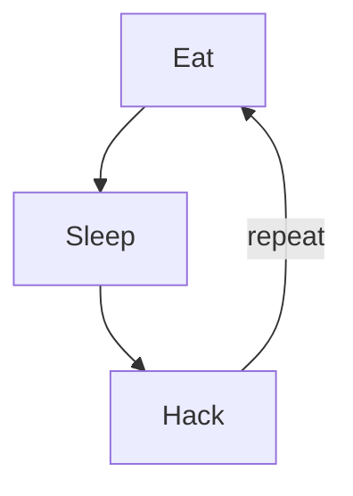

$$ (Python + Cryptography) \land CTF\implies Fun $$

```python
STR_HELLO = "Hello World!"
print(STR_HELLO)
```


```mermaid
graph TD
  A[Eat] -->B[Sleep]
  B --> C[Hack]
  C --> |repeat| A
```

[](https://github.com/deut-erium/ctf-tutorials/)
